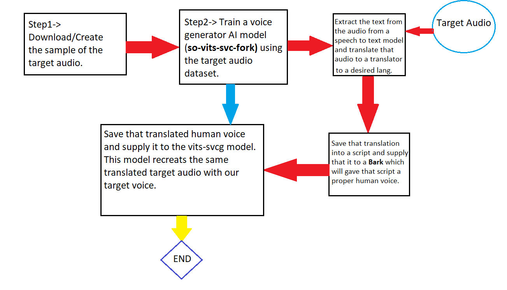

# **VTclone🎙**

**💥 Disclamer ->** This project is made for a assignment  not for any commercial use it only for pure educational purposes❗❗❗.

## **Basic Work Flow of the project💪** 

## **Target Voice🙎‍♂️ - Elone Musk🎤**

The basic approach which was used to clone this is to provide the audio into the **so-vits-svc-fork** model. This model was trained on our target voice data of Elone Musk for max of 827 epochs out of 9999 which is significantly low but enough to give a good idea about the entire model. Then text is extracted from the  **Original Sample Audio** and translated to hindi text using python scripts. Then that hindi text is provide to Bark and AI model which make human like speech using one of its preset voice. We save that translated voice and provide it to the **so-vits-svc-fork** and this time it regenrate that translated voice using Elone Musk voice 🎉🎉.

## **Imortant Points💡**

1) If the model **so-vits-svc-fork**  was trained for more epochs the results will be much better. Rember it is only 827 out of 9999 (827/9999).
2) The reasone for using this hybrid method is purley to get the most human like voice.
3) I have attached the dataset used for this project which is created by me.
4) Google Colab was used in order to save time and to deal with low hardware power.
5) I am attaching the model weights in this repository so if some one wants to try **so-vits-svc-fork** with Elon Musk voice can try it.
6) 🥇Please do check all the outputs 🙏🙏.

## **Links🔗**

**so-vits-svc-fork->** [https://github.com/voicepaw/so-vits-svc-fork]

**so-vits-svc-fork(colab notebook)📖->** [https://colab.research.google.com/github/34j/so-vits-svc-fork/blob/main/notebooks/so-vits-svc-fork-4.0.ipynb#scrollTo=Ev4VsHv4Dgm-]

**Suno Bark🐶->** [https://github.com/suno-ai/bark]

## [Model Weights]🤖

**G_800.pth->** https://drive.google.com/file/d/104TtDbFNpJnmT8zME_alUDr-0g5n8_UF/view?usp=sharing

**D_800.pth->** https://drive.google.com/file/d/105fJbA7Jb6WUj9bkyVapIvETjbhkGF-6/view?usp=sharing

------------------------------------

**🎵 Original Sample Audio🔊**

https://github.com/KshitijxFrl/VTclone/assets/95994227/6d97cb84-bbaf-4a03-9e09-cccd15a829f2

**🎵 Output Generated Audio(Hindi)🔊**

https://github.com/KshitijxFrl/VTclone/assets/95994227/e2d80b8a-fe9f-4424-b256-46edb5ae3fa8

-------------------------------------

**🎵 Original Song🔊**

https://github.com/KshitijxFrl/VTclone/assets/95994227/e3568131-0d88-4b27-8682-93de5a559e8a

**🎵 Output Generated Audio (Song)🔊**

https://github.com/KshitijxFrl/VTclone/assets/95994227/e95eb9ff-ede2-4671-b509-977abce26e5f

# 🚨 [VT Clone] Update:- 1.0.0.1 🏆

▶ This is the latest version of VTclone pipelien and this replaces the key model for the overlay component so-vits-svc to the latest model RVC which use ContentVec as its content encoder rather than HuBERT (ContentVec is a updated version HuBERT).

**🎵 RVC Generated Audio(Hindi)🔊**

https://github.com/KshitijxFrl/VTclone/assets/95994227/6019b1dc-5777-4428-b4d5-6b206ed93e8c

**🎵 RVC Generated Audio(Hindi) + Pitch Pace Adjested 🔊**

https://github.com/KshitijxFrl/VTclone/assets/95994227/a899e49b-236b-4701-9894-dfb09fbb2610

[WEIGHTS]:- Will be provided soon.

# Experimental 🧪 

This section feature expermintal audio which is created by using modefied pipeline with different models with similar data.

🎯This project was made by using google colab, personal hardware and multiple python scripts.

## **⭐Dev Note:- For any query feel free to reach out 😄.**
